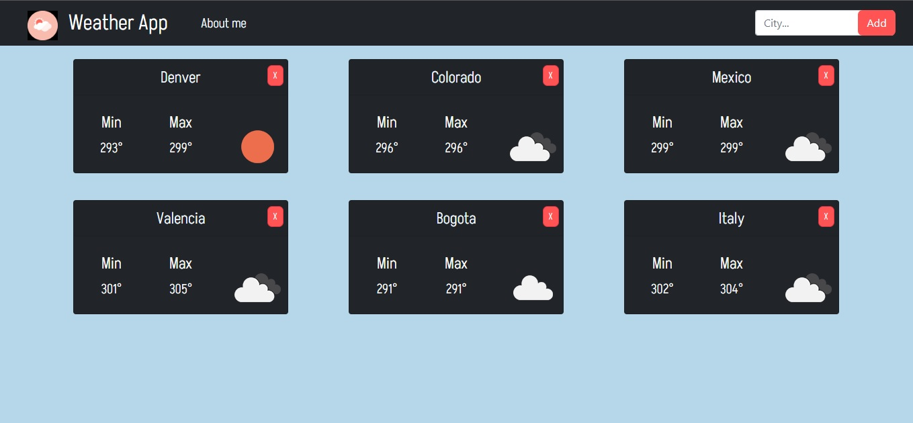

## Weather App

Esta es mi primera app con react. de igual forma primera vez que maneje una API
Me encanto el recorrido de empezar desde cero hasta el producto final, empece conociendo los tipos de componentes y como usarlos, conociendo los estados y las props. 

La app permite al usuario buscar una ciudad y obtener el clima de esa ciudad, de igual forma acceder a la informacion de la ciudad.

Es el principio mi camino aprendiendo React, espero que la disfruten!♥

## APP

  

